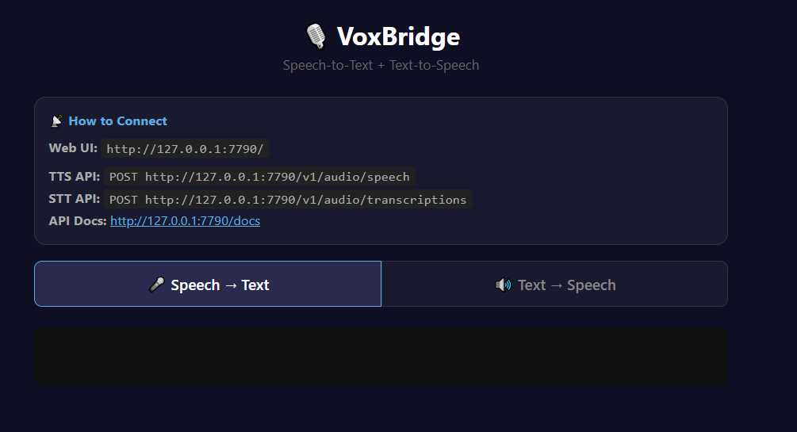

# 🎙️ VoxBridge

A combined **Speech-to-Text** and **Text-to-Speech** voice server running entirely locally. No cloud APIs, no API keys needed.



## Features

- **STT:** Arabic + English auto-detect with code-switching (mixing both languages in one sentence)
- **TTS:** Supertonic 3 — 10 voices (5 male, 5 female), supports Arabic and English
- **Single process** — one command starts everything
- **Web UI** — voice recorder + TTS tester with tabbed interface
- **OpenAI-compatible APIs** — drop-in replacement for any OpenAI TTS/STT client
- **GPU acceleration** — uses CUDA if available, falls back to CPU

## Quick Start

### Option A: One-Command Install (easiest)

Open **PowerShell** and paste this single command. It will download, extract, and start the setup automatically:

```powershell
mkdir $env:TEMP\VoxBridge-setup -Force | Out-Null; cd $env:TEMP\VoxBridge-setup; irm https://raw.githubusercontent.com/Alihkhawaher/VoxBridge/master/setup.bat -OutFile setup.bat; irm https://raw.githubusercontent.com/Alihkhawaher/VoxBridge/master/create-shortcut.ps1 -OutFile create-shortcut.ps1; .\setup.bat
```

**What this does:**
1. Downloads `setup.bat` and `create-shortcut.ps1` to a temp folder
2. `setup.bat` auto-requests Administrator privileges
3. Installs all prerequisites (Python, Git, Git LFS, uv, Chocolatey — only installs what's missing)
4. Clones the project to `VoxBridge` in your home folder (or runs `git pull` if already installed)
5. Creates virtual environment, installs dependencies, downloads STT model (~1.5GB)
6. Creates a **VoxBridge shortcut on your Desktop**

**Subsequent runs** detect the existing installation and run `git pull` to update, then skip already-completed steps.

After setup completes, double-click the **VoxBridge** shortcut on your Desktop, or `start.bat` inside the `VoxBridge` folder.

### Option B: Manual Download

1. Go to **https://github.com/Alihkhawaher/VoxBridge**
2. Click the green **<> Code** button
3. Click **Download ZIP**
4. Extract the ZIP file to any folder (right-click → "Extract All...")
5. Open the extracted `VoxBridge-master` folder
6. Double-click **`setup.bat`** (requires Administrator privileges)

### Option C: Git Clone

```bash
git clone https://github.com/Alihkhawaher/VoxBridge.git
cd VoxBridge
setup.bat
```

### After Setup

**`setup.bat`** will (first time only):

1. Check for Python, Git, Git LFS, and uv
2. Install any missing tools via [Chocolatey](https://chocolatey.org/)
3. Create a Python virtual environment
4. Install all dependencies from `requirements.txt`
5. Download the Arabic-English STT model (~1.5GB)

> **Note:** `setup.bat` requires Administrator privileges to auto-install missing tools (Chocolatey, Python, Git, etc.).

### Start the server

Double-click **`start.bat`**, or run:

```bash
stt-env\Scripts\python.exe voice-server.py
```

### Open the Web UI

Go to: **http://127.0.0.1:7790/**


## API Reference

### STT — Speech-to-Text

**`POST /v1/audio/transcriptions`** — OpenAI-compatible

```bash
curl -X POST http://127.0.0.1:7790/v1/audio/transcriptions \
  -F "file=@audio.wav"
```

Response:
```json
{
  "text": "السلام عليكم ورحمة الله وبركاته, my name is Ali",
  "language": "ar",
  "language_probability": 0.85,
  "duration": 5.2,
  "segments": [
    {"start": 0.0, "end": 5.2, "text": "السلام عليكم ورحمة الله وبركاته, my name is Ali"}
  ],
  "processing_time": 2.1
}
```

Optional form fields:
- `language` — Language hint (e.g., `ar`, `en`). If omitted, auto-detects.
- `response_format` — `json` (default) or `verbose_json`.

### TTS — Text-to-Speech

**`POST /v1/audio/speech`** — OpenAI-compatible

```bash
curl -X POST http://127.0.0.1:7790/v1/audio/speech \
  -H "Content-Type: application/json" \
  -d '{"model":"supertonic-3","input":"Hello world","voice":"M1","response_format":"wav","speed":1.0}' \
  --output speech.wav
```

Body fields:
- `input` (required) — Text to synthesize
- `voice` — `M1`-`M5` or `F1`-`F5` (default: `M1`)
- `response_format` — `wav`, `flac`, or `ogg` (default: `wav`)
- `speed` — Playback speed: `0.8`, `0.9`, `1.0`, `1.1`, `1.2` (default: `1.0`)

**`GET /v1/voices`** — List available voices

**`GET /v1/styles`** — List voice styles

### General

**`GET /`** — Web UI

**`GET /api/info`** — Server status

**`GET /docs`** — Interactive API documentation (Swagger UI)

## Configuration

All configuration is via environment variables (set before starting the server):

| Variable | Default | Description |
|----------|---------|-------------|
| `VOICE_PORT` | `7790` | Server port |
| `VOICE_HOST` | `127.0.0.1` | Bind address. Use `0.0.0.0` to allow network access |
| `CUDA_DEVICE` | *(auto-detect)* | GPU index for STT model (e.g., `0`, `1`) |

Example:
```bash
set VOICE_PORT=8080
set VOICE_HOST=0.0.0.0
set CUDA_DEVICE=0
stt-env\Scripts\python.exe voice-server.py
```

## Project Structure

```
├── setup.bat            # One-time setup script (install everything)
├── start.bat            # Quick start the server
├── create-shortcut.ps1  # Desktop shortcut + icon generator
├── requirements.txt     # Python dependencies
├── voice-server.py      # Combined STT + TTS server
├── voxbridge.ico        # Application icon (generated by setup)
├── static/
│   └── index.html       # Web UI (voice recorder + TTS tester)
├── stt-env/             # Python virtual environment (created by setup)
└── whisper-ar-en/       # Arabic-English Whisper model (downloaded by setup)
```

## System Requirements

### Minimum (CPU only)

| Component | Requirement |
|-----------|-------------|
| **OS** | Windows 10/11 (64-bit) |
| **CPU** | 4-core modern processor (Intel i5 8th gen / AMD Ryzen 5 2600 or better) |
| **RAM** | 8 GB |
| **Disk** | 4 GB free space (model ~1.5GB + dependencies ~1.5GB) |
| **Internet** | Required for initial setup only (model download) |

> ⚠️ **CPU-only mode is slow.** STT transcription of a 10-second audio clip may take 30–60 seconds. TTS will also be noticeably slower.

### Recommended (with GPU)

| Component | Requirement |
|-----------|-------------|
| **OS** | Windows 10/11 (64-bit) |
| **CPU** | 4+ core processor |
| **RAM** | 16 GB |
| **GPU** | NVIDIA GPU with 4+ GB VRAM (CUDA 11.7+) |
| **GPU Examples** | GTX 1060 6GB, RTX 2060, RTX 3060, RTX 4070 |
| **Disk** | 4 GB free space |

> ✅ **GPU mode is fast.** STT transcription of a 10-second clip takes 1–3 seconds. TTS generates audio in near real-time.

### Software Prerequisites

These are automatically installed by `setup.bat`:

| Software | Purpose |
|----------|---------|
| **Python 3.11** | Runtime |
| **Git + Git LFS** | Model download |
| **uv** | Python package manager |
| **CUDA Toolkit** | GPU acceleration (if NVIDIA GPU available) |

### Notes

- **NVIDIA GPU required for GPU mode** — AMD/Intel GPUs are not supported (CUDA-only)
- **VRAM usage:** STT model uses ~2 GB VRAM, TTS model uses ~1 GB VRAM
- **First launch is slow** — models need to load into memory (30–60 seconds)
- **Subsequent requests** are much faster once models are loaded

## Models

### STT — [faster-whisper-large-v2-ar-codeswitching](https://huggingface.co/Mano200600/faster-whisper-large-v2-ar-codeswitching)

A fine-tuned [Faster-Whisper](https://github.com/SYSTRAN/faster-whisper) (Large-v2) model optimized for **Arabic-English code-switching** — handling mixed-language speech where Arabic and English are used interchangeably in the same sentence. Based on OpenAI's Whisper architecture, converted to CTranslate2 for fast inference.

- **Fine-tuned by:** [Mohamed Rashad (Mano200600)](https://huggingface.co/Mano200600)
- **Base model:** OpenAI Whisper Large-v2
- **Languages:** Arabic + English (code-switching)

### TTS — [Supertonic 3](https://github.com/supertone-inc/supertonic)

A high-quality multilingual text-to-speech model by **Supertone Inc.** (HYBE). Generates natural-sounding speech with 10 built-in voices (5 male, 5 female). Supports multiple languages including Arabic and English.

- **Created by:** [Supertone Inc.](https://supertone.ai/) (a HYBE company)
- **Version:** Supertonic 3
- **Voices:** M1–M5 (male), F1–F5 (female)

## Tech Stack

| Component | Technology |
|-----------|-----------|
| STT Engine | [Faster-Whisper](https://github.com/SYSTRAN/faster-whisper) (CTranslate2) |
| STT Model | [faster-whisper-large-v2-ar-codeswitching](https://huggingface.co/Mano200600/faster-whisper-large-v2-ar-codeswitching) |
| TTS Engine | [Supertonic 3](https://github.com/supertone-inc/supertonic) |
| Web Framework | [FastAPI](https://fastapi.tiangolo.com/) |
| Package Manager | [uv](https://docs.astral.sh/uv/) |

## Credits

- **OpenAI** — Whisper speech recognition architecture ([paper](https://arxiv.org/abs/2212.04356), [GitHub](https://github.com/openai/whisper))
- **Mohamed Rashad** — Arabic-English code-switching Whisper fine-tune ([HuggingFace](https://huggingface.co/Mano200600/faster-whisper-large-v2-ar-codeswitching))
- **Supertone Inc. (HYBE)** — Supertonic 3 TTS model ([GitHub](https://github.com/supertone-inc/supertonic), [Website](https://supertone.ai/))
- **SYSTRAN** — Faster-Whisper CTranslate2 inference engine ([GitHub](https://github.com/SYSTRAN/faster-whisper))
